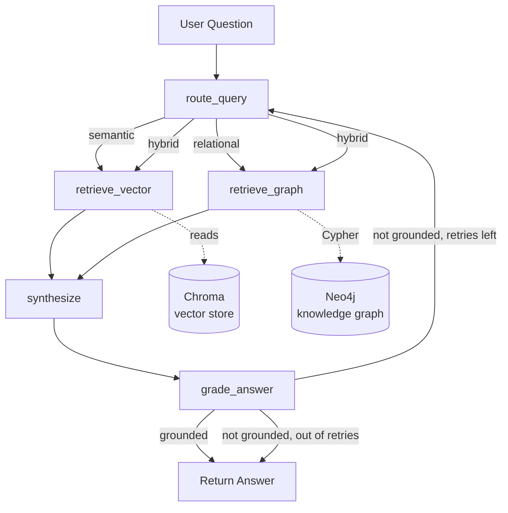

# GraphRAG Research Assistant

An agentic Q&A system over research papers that combines **vector RAG**
(semantic search over paper text) with a **Neo4j knowledge graph**
(authors, methods, datasets, citations), orchestrated by a **LangGraph**
agent that routes each question to the right retrieval strategy and
self-checks its own answers before returning them.

## Why two retrieval paths

- *"What does the paper say about attention mechanisms?"* → semantic
  content question → vector search over chunked paper text.
- *"Which papers did this one cite, and who wrote them?"* → relational
  question → graph traversal, not text similarity.
- *"How does this method compare to what it cites?"* → hybrid → both,
  merged at synthesis.

A single vector index can't answer the second question well, and a
graph alone can't answer the first — that gap is the actual reason
this project needs an agent instead of a single retrieval chain.

## Architecture



**Ingestion pipeline** (`scripts/ingest.py`): PDFs → chunked text →
Chroma embeddings, and PDFs → LLM entity/relation extraction → Neo4j
graph (`Paper`, `Author`, `Concept`, `Method`, `Dataset` nodes).

## Project layout

```
config.py                 # pydantic settings, single source of env config
ingestion/
  pdf_loader.py            # load + chunk PDFs
  vector_store.py          # Chroma build/load
  graph_builder.py         # LLM extraction -> Neo4j MERGE writes
agent/
  state.py                 # LangGraph state schema
  tools.py                 # vector_search, graph_search (Cypher QA chain)
  nodes.py                 # route / retrieve / synthesize / grade
  graph.py                 # StateGraph wiring + conditional edges
api/main.py                # FastAPI /query endpoint
ui/streamlit_app.py        # chat demo UI
scripts/ingest.py          # CLI ingestion entrypoint
tests/                     # fully mocked, run offline/in CI
```

## Setup — runs entirely free, no API key required

The LLM runs locally via **Ollama** and embeddings run locally via a
**HuggingFace sentence-transformers** model. No OpenAI account, no
billing, no per-call cost. The only real cost is your machine's RAM/CPU
(and time — local models are slower than a hosted API).

1. **Install Ollama:** download from [ollama.com](https://ollama.com), then pull a model:
   ```bash
   ollama pull llama3.1        # ~4.7GB, needs ~8GB RAM
   # if that's too heavy for your machine, use a smaller model instead:
   # ollama pull llama3.2      # ~2GB, needs ~4GB RAM — set CHAT_MODEL=llama3.2 in .env
   ```
   Ollama runs as a background service after install — verify with `ollama list`.

2. **Start Neo4j:**
   ```bash
   docker compose up -d
   ```
3. **Install deps:**
   ```bash
   python -m venv .venv && source .venv/bin/activate
   pip install -r requirements.txt
   ```
4. **Configure:**
   ```bash
   cp .env.example .env
   # defaults already point at local Ollama + local embeddings — no key needed
   ```
5. **Add papers:** drop a few PDFs into `papers/`.
6. **Ingest:**
   ```bash
   python -m scripts.ingest
   ```
   First run also downloads the embedding model (~90MB, one-time, free, from HuggingFace).
7. **Run:**
   ```bash
   uvicorn api.main:app --reload        # API on :8000
   # or
   streamlit run ui/streamlit_app.py    # chat UI
   ```
8. **Test** (no services needed — everything's mocked):
   ```bash
   pytest -v
   ```

### Note on structured output with local models

`with_structured_output` (used for routing, entity extraction, and
groundedness grading) relies on the model's tool-calling ability.
`llama3.1` and `qwen2.5` handle this reliably; some smaller/older
Ollama models don't and will throw parsing errors — if you hit that,
switch `CHAT_MODEL` in `.env` to `qwen2.5` (`ollama pull qwen2.5` first).

## Design decisions worth mentioning in an interview

- **Deterministic routing over free-form tool-calling.** The router
  classifies query type once, then nodes are called directly rather
  than letting the LLM pick tools every turn — cheaper, more
  predictable, and easier to debug than an open-ended ReAct loop for
  this fixed set of two retrieval strategies.
- **Self-grading with a bounded retry loop**, not an infinite agent
  loop — `max_retries` in config prevents runaway API cost from a
  question the system genuinely can't answer.
- **MERGE, not CREATE**, throughout the graph writes — ingestion is
  idempotent and safe to re-run.
- **Graph query failures degrade to "no relational facts found"**
  rather than raising — a Neo4j hiccup shouldn't take down the whole
  answer if vector context alone can partially answer the question.
- **`allow_dangerous_requests=True`** on `GraphCypherQAChain` is
  scoped intentionally: this graph only holds paper metadata (no PII,
  no write-sensitive data), and the schema has no destructive
  relationship types — worth calling out that you understand what
  that flag actually permits (LLM-generated Cypher can in principle
  write/delete) rather than turning it on blindly.

## Honest scope notes (say this in interviews, don't skip it)

This is a working, well-structured **portfolio project**, not a
battle-tested production system. It's fair to describe as such and to
walk through the design decisions above. It does *not* currently have:
observability/tracing (would add LangSmith), auth on the API,
rate limiting, batch/async ingestion for large corpora, evaluation
metrics on the retrieval/routing quality (would add a small labeled
eval set + RAGAS), or load testing. Naming these gaps unprompted in an
interview reads as engineering maturity, not weakness — claiming
"production-grade" without them, and then not being able to answer a
follow-up about uptime or scale, reads worse.

## Suggested resume bullets

- Built an agentic RAG system combining vector search and a Neo4j
  knowledge graph, using LangGraph to route queries between semantic
  and relational retrieval strategies based on query classification.
- Designed a self-correcting agent loop with automated groundedness
  checking, reducing unsupported answers via a bounded retry mechanism.
- Implemented an idempotent LLM-based knowledge graph extraction
  pipeline (structured output + Cypher MERGE) to build a queryable
  graph of paper/author/method/citation relationships from unstructured PDFs.
